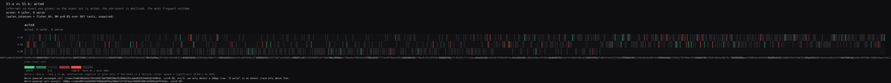

# S1-a vs S1-b: acted

inferred: no event was given, so the event set is acted; the non-event is declined, the most frequent outcome

acted: 0 safer, 0 worse
(aalen_johansen + fisher_bh, BH q<0.05 over 847 tests, unpaired)

## Omnibus

"no cell changed" is not rejected (p = 0.342664 >= q 0.05) over 847 cells x 1 event

min-p of location and dispersion; 4000 within-cell permutations, arm_label, seed 0

p floor 2.50e-04: the smallest p 4000 permutations can express; a p at the floor is a bound, not a measurement

| event | mean delta (pp) | p | rms delta (pp) | p |
|---|---|---|---|---|
| acted | 1.3 | 0.343 | 35.9 | 1 |

informative cells: 109 of 847; 738 unchanged by every exchange

## Fault lines

grouping cut (axis), 3 groups; cells per group min 261 / median 286 / max 300; 0 degenerate; 3 of 3 groups resolve 20pp at alpha 0.0167

"no cell in the group changed" not tested: the root did not reject

| cut | cells | informative | unchanged by every exchange | units (a/b) | group MDE (pp) |
|---|---|---|---|---|---|
| 0.50 | 286 | 46 | 240 | 286/286 | 13.4pp |
| 0.60 | 261 | 48 | 213 | 261/261 | 14.0pp |
| 0.90 | 300 | 15 | 285 | 300/300 | 13.1pp |

## Cells

not tested: the root did not reject

## Bound

depth 3 (3 configured); outer-nodes false discovery rate at most 0.432 = 2 x 3 x 0.05 x 1.44

Yekutieli (2008) Corollary A.2 assumes each p-value is independent of its ancestors; this tree's group and root statistics aggregate their own cells, so that assumption is not established here.

## acted: 0 safer, 0 worse

| item | cut | n (a/b) | rate_a (pp) | rate_b (pp) | delta (pp) | p | q | verdict | MDE |
|---|---|---|---|---|---|---|---|---|---|
| 0afdf41311699d24946ad95be8d8109fed69075c69f44d4055274a6bc94169b6 | 0.60 | 1/1 | 0.0 | 100.0 | 100.0 | 1 | 1 | unchanged | 100pp |
| 1201207549fd8442fe4312546a573d4dbebdcb9927c43f8e0da68ebcae0713bd | 0.60 | 1/1 | 0.0 | 100.0 | 100.0 | 1 | 1 | unchanged | 100pp |
| 0916680a917d75cbd8418b067b53bad172bbffd20a6a70b80b07ba0cb7bbc681 | 0.60 | 1/1 | 0.0 | 100.0 | 100.0 | 1 | 1 | unchanged | 100pp |
| 2c994aeedfe545e6df84ab2cfcb14a5668b188dbd79ee653f0da24094a08a013 | 0.50 | 1/1 | 0.0 | 100.0 | 100.0 | 1 | 1 | unchanged | 100pp |
| 0e096a82fc87e69f7d9d51e42611fd8b252dda6e14b417d9de62b8edcab29cfd | 0.60 | 1/1 | 0.0 | 100.0 | 100.0 | 1 | 1 | unchanged | 100pp |
| 01b70492a6743bab3fa622c958d0041c2082d84b049b965245b57feb0781d9fa | 0.60 | 1/1 | 0.0 | 100.0 | 100.0 | 1 | 1 | unchanged | 100pp |
| 4ca53f2d9582b3b5425dead643faff5cd2874b5ae2fe3969a2701cd1aa52ada3 | 0.50 | 1/1 | 0.0 | 100.0 | 100.0 | 1 | 1 | unchanged | 100pp |
| 01c29c3077c9c23cff855ac38ada61299bcc7a77108a2b7c1db4b6b258532968 | 0.60 | 1/1 | 0.0 | 100.0 | 100.0 | 1 | 1 | unchanged | 100pp |
| 0009c64f696772e54374065b5a0ae7c6c9ef72a7a8b118a473961c6301fd30a8 | 0.60 | 1/1 | 0.0 | 100.0 | 100.0 | 1 | 1 | unchanged | 100pp |
| 0402de8d61500eec48e506e7a32bf31f9385d4fb4a81cc8199c6b3aa0155796d | 0.90 | 1/1 | 0.0 | 100.0 | 100.0 | 1 | 1 | unchanged | 100pp |

Worst-powered unchanged cell (item=22a8d3863dd117641d56f3a0f608396b7619b0e101cdded653534b01814300c8, cut=0.50, n=1/1) can only detect a 100pp rise. "0 worse" is an honest claim only above that.
Worst-powered cell overall: 100pp (item=001febe0449270db8ad8f6ae560e212ffdf4aac59d09c606cb25602adf5f2e5e, cut=0.50).

## Intervals

intervals: none (nothing significant; the MDE lines above are the honest bound)

## Paired replay

Two stored arms are a pair only when they were the same request twice; the assertion ran before any comparison, and every count reconciles in pair_assertion.json.

### 0.50 (threshold 0.50, gt)

- S1: n11 = 91, n10 = 20, n01 = 26, n00 = 149, n = 286; ties a = 29, b = 19; rate a 0.3881118881118881, rate b 0.4090909090909091; flip rate 0.16083916083916083 [0.12022493441814232, 0.20864560699102644] (exact binomial), net swing 0.02097902097902098 (b minus a) -- items chosen to sit beside a cut; not a rate for production traffic
  arm order check: p = 0.4613911821367651, n discordant = 46, can reject = true
- S2: n11 = 83, n10 = 24, n01 = 31, n00 = 148, n = 286; ties a = 35, b = 31; rate a 0.3741258741258741, rate b 0.3986013986013986; flip rate 0.19230769230769232 [0.14828304553008953, 0.2428356255389663] (exact binomial), net swing 0.024475524475524476 (b minus a) -- items chosen to sit beside a cut; not a rate for production traffic
  arm order check: p = 0.4187541882690154, n discordant = 55, can reject = true
- S3: n11 = 87, n10 = 28, n01 = 30, n00 = 141, n = 286; ties a = 27, b = 22; rate a 0.4020979020979021, rate b 0.4090909090909091; flip rate 0.20279720279720279 [0.1577445041815074, 0.25412578038208217] (exact binomial), net swing 0.006993006993006993 (b minus a) -- items chosen to sit beside a cut; not a rate for production traffic
  arm order check: p = 0.8956832138895906, n discordant = 58, can reject = true
- pooled over 286 items and 3 sweeps: flip rate 0.1853146853146853 [0.15384615384615385, 0.21794871794871795] (cluster bootstrap), net swing 0.017482517482517484 [-0.01282051282051282, 0.047785547785547784] (cluster bootstrap) (b minus a) -- items chosen to sit beside a cut; not a rate for production traffic
  design effect: icc 0.2602006327231431, m_bar 3.0, deff 1.5204012654462862; ineligibility rate 0.0
  outcome: B, decided from the pooled flip rate interval [0.15384615384615385, 0.21794871794871795] (cluster bootstrap).

### 0.60 (threshold 0.60, gt)

- S1: n11 = 81, n10 = 19, n01 = 29, n00 = 132, n = 261; ties a = 30, b = 15; rate a 0.3831417624521073, rate b 0.421455938697318; flip rate 0.1839080459770115 [0.138823220728321, 0.23633176774454773] (exact binomial), net swing 0.038314176245210725 (b minus a) -- items chosen to sit beside a cut; not a rate for production traffic
  arm order check: p = 0.19341265286193737, n discordant = 48, can reject = true
- S2: n11 = 74, n10 = 20, n01 = 26, n00 = 141, n = 261; ties a = 24, b = 27; rate a 0.36015325670498083, rate b 0.3831417624521073; flip rate 0.17624521072796934 [0.13201776118103525, 0.2279955576694811] (exact binomial), net swing 0.022988505747126436 (b minus a) -- items chosen to sit beside a cut; not a rate for production traffic
  arm order check: p = 0.4613911821367651, n discordant = 46, can reject = true
- S3: n11 = 80, n10 = 23, n01 = 28, n00 = 130, n = 261; ties a = 18, b = 18; rate a 0.3946360153256705, rate b 0.41379310344827586; flip rate 0.19540229885057472 [0.14908823460623702, 0.24878052818804333] (exact binomial), net swing 0.019157088122605363 (b minus a) -- items chosen to sit beside a cut; not a rate for production traffic
  arm order check: p = 0.5758493477318467, n discordant = 51, can reject = true
- pooled over 261 items and 3 sweeps: flip rate 0.18518518518518517 [0.1545338441890166, 0.21711366538952745] (cluster bootstrap), net swing 0.02681992337164751 [-0.002554278416347382, 0.0561941251596424] (cluster bootstrap) (b minus a) -- items chosen to sit beside a cut; not a rate for production traffic
  design effect: icc 0.1634890371782649, m_bar 3.0, deff 1.3269780743565298; ineligibility rate 0.0
  outcome: B, decided from the pooled flip rate interval [0.1545338441890166, 0.21711366538952745] (cluster bootstrap).

### 0.90 (threshold 0.90, gt)

- S1: n11 = 155, n10 = 10, n01 = 5, n00 = 130, n = 300; ties a = 25, b = 29; rate a 0.55, rate b 0.5333333333333333; flip rate 0.05 [0.02825120196849638, 0.08112735717076422] (exact binomial), net swing -0.016666666666666666 (b minus a) -- items chosen to sit beside a cut; not a rate for production traffic
  arm order check: p = 0.30175781249999994, n discordant = 15, can reject = true
- S2: n11 = 157, n10 = 10, n01 = 7, n00 = 126, n = 300; ties a = 22, b = 24; rate a 0.5566666666666666, rate b 0.5466666666666666; flip rate 0.056666666666666664 [0.033353311516684594, 0.08918040443416299] (exact binomial), net swing -0.01 (b minus a) -- items chosen to sit beside a cut; not a rate for production traffic
  arm order check: p = 0.629058837890625, n discordant = 17, can reject = true
- S3: n11 = 156, n10 = 5, n01 = 11, n00 = 128, n = 300; ties a = 28, b = 20; rate a 0.5366666666666666, rate b 0.5566666666666666; flip rate 0.05333333333333334 [0.03078831977347806, 0.08516676490951426] (exact binomial), net swing 0.02 (b minus a) -- items chosen to sit beside a cut; not a rate for production traffic
  arm order check: p = 0.210113525390625, n discordant = 16, can reject = true
- pooled over 300 items and 3 sweeps: flip rate 0.05333333333333334 [0.035555555555555556, 0.07222222222222222] (cluster bootstrap), net swing -0.0022222222222222222 [-0.015555555555555555, 0.011111111111111112] (cluster bootstrap) (b minus a) -- items chosen to sit beside a cut; not a rate for production traffic
  design effect: icc 0.29702194357366757, m_bar 3.0, deff 1.5940438871473352; ineligibility rate 0.0
  outcome: B, decided from the pooled flip rate interval [0.035555555555555556, 0.07222222222222222] (cluster bootstrap).

## Replicates

Each item was sent k times per sweep. agree@j is the rate at which the first j calls of an item in one sweep all took one action, so all j decisions agreed; MS@j is the rate at which two sweeps' j-call majority decisions for one item agreed. Both are computed under the cut's declared comparison (primary) and under the other one (sensitivity), and every interval is the item-clustered bootstrap.

### 0.50 (threshold 0.50, gt, k = 5)

- 286 items over 3 sweeps; eligible sets per sweep: S1 286, S2 286, S3 286; items with both sets eligible per sweep pair: S1|S2 286, S1|S3 286, S2|S3 286; ties per arm: arm-a 91, arm-b 72, arm-3 74, arm-4 70, arm-5 81; the majority curve stops at j = 5

Under the primary rule (gt):

- agree@2: 0.8146853146853147 [0.782051282051282, 0.8461538461538461] (cluster bootstrap); icc 0.2602006327231431, m_bar 3.0, deff 1.5204012654462862 -- items chosen to sit beside a cut; not a rate for production traffic
- agree@3: 0.7086247086247086 [0.668997668997669, 0.747086247086247] (cluster bootstrap); icc 0.323932525039536, m_bar 3.0, deff 1.647865050079072 -- items chosen to sit beside a cut; not a rate for production traffic
- agree@4: 0.6421911421911422 [0.5979020979020979, 0.6853146853146853] (cluster bootstrap); icc 0.4230120346417726, m_bar 3.0, deff 1.8460240692835452 -- items chosen to sit beside a cut; not a rate for production traffic
- agree@5: 0.5944055944055944 [0.5466200466200466, 0.6410256410256411] (cluster bootstrap); icc 0.5370245025043995, m_bar 3.0, deff 2.074049005008799 -- items chosen to sit beside a cut; not a rate for production traffic
- step agree@2 to agree@3: -0.10606060606060606 [-0.1282051282051282, -0.08508158508158509] (cluster bootstrap), paired on the same draws
- step agree@3 to agree@4: -0.06643356643356643 [-0.08275058275058275, -0.05011655011655012] (cluster bootstrap), paired on the same draws
- step agree@4 to agree@5: -0.047785547785547784 [-0.06293706293706294, -0.0337995337995338] (cluster bootstrap), paired on the same draws
- MS@1: 0.8275058275058275 [0.7948717948717948, 0.8601398601398601] (cluster bootstrap); icc 0.39703808180535954, m_bar 3.0, deff 1.7940761636107192 -- items chosen to sit beside a cut; not a rate for production traffic
- MS@3: 0.8484848484848485 [0.8158508158508159, 0.8811188811188811] (cluster bootstrap); icc 0.41196698762035744, m_bar 3.0, deff 1.8239339752407149 -- items chosen to sit beside a cut; not a rate for production traffic
- MS@5: 0.8834498834498834 [0.8531468531468531, 0.9114219114219114] (cluster bootstrap); icc 0.43527080581241756, m_bar 3.0, deff 1.870541611624835 -- items chosen to sit beside a cut; not a rate for production traffic
- MS@1 cost framing: out of 10,000 near-cut decisions, 1725 decided differently [1399, 2051] -- items chosen to sit beside a cut; not a rate for production traffic; dollars per decision 1.61208694214876e-05 (mean recorded input tokens 383.8302243211334 at a price of 0.000000042 per input token); latency per decision 0.246673 s serial (median call 0.246673 s), 0.06166825 s at the declared concurrency
- MS@3 cost framing: out of 10,000 near-cut decisions, 1515 decided differently [1189, 1841] -- items chosen to sit beside a cut; not a rate for production traffic; dollars per decision 4.8362608264462814e-05 (mean recorded input tokens 383.8302243211334 at a price of 0.000000042 per input token); latency per decision 0.740019 s serial (median call 0.246673 s), 0.18500475 s at the declared concurrency
- MS@5 cost framing: out of 10,000 near-cut decisions, 1166 decided differently [886, 1469] -- items chosen to sit beside a cut; not a rate for production traffic; dollars per decision 8.060434710743801e-05 (mean recorded input tokens 383.8302243211334 at a price of 0.000000042 per input token); latency per decision 1.233365 s serial (median call 0.246673 s), 0.30834125 s at the declared concurrency

Under the sensitivity rule (ge):

- agree@2: 0.8088578088578089 [0.778525641025641, 0.837995337995338] (cluster bootstrap); icc 0.17206591781400746, m_bar 3.0, deff 1.344131835628015 -- items chosen to sit beside a cut; not a rate for production traffic
- agree@3: 0.7027972027972028 [0.6643356643356644, 0.7400932400932401] (cluster bootstrap); icc 0.30381395954792684, m_bar 3.0, deff 1.6076279190958536 -- items chosen to sit beside a cut; not a rate for production traffic
- agree@4: 0.6410256410256411 [0.5967365967365967, 0.6841491841491841] (cluster bootstrap); icc 0.4440832249674902, m_bar 3.0, deff 1.8881664499349804 -- items chosen to sit beside a cut; not a rate for production traffic
- agree@5: 0.5967365967365967 [0.5501165501165501, 0.6433566433566433] (cluster bootstrap); icc 0.5216553454570114, m_bar 3.0, deff 2.043310690914023 -- items chosen to sit beside a cut; not a rate for production traffic
- step agree@2 to agree@3: -0.10606060606060606 [-0.12703962703962704, -0.08624708624708624] (cluster bootstrap), paired on the same draws
- step agree@3 to agree@4: -0.06177156177156177 [-0.07925407925407925, -0.045454545454545456] (cluster bootstrap), paired on the same draws
- step agree@4 to agree@5: -0.04428904428904429 [-0.05827505827505827, -0.03146853146853147] (cluster bootstrap), paired on the same draws
- MS@1: 0.8065268065268065 [0.7715617715617715, 0.8414918414918415] (cluster bootstrap); icc 0.3813314037626628, m_bar 3.0, deff 1.7626628075253254 -- items chosen to sit beside a cut; not a rate for production traffic
- MS@3: 0.8578088578088578 [0.8251748251748252, 0.8881118881118881] (cluster bootstrap); icc 0.4183673469387756, m_bar 3.0, deff 1.8367346938775513 -- items chosen to sit beside a cut; not a rate for production traffic
- MS@5: 0.8717948717948718 [0.8414918414918415, 0.9020979020979021] (cluster bootstrap); icc 0.42771084337349397, m_bar 3.0, deff 1.855421686746988 -- items chosen to sit beside a cut; not a rate for production traffic
- MS@1 cost framing: out of 10,000 near-cut decisions, 1935 decided differently [1585, 2284] -- items chosen to sit beside a cut; not a rate for production traffic; dollars per decision 1.61208694214876e-05 (mean recorded input tokens 383.8302243211334 at a price of 0.000000042 per input token); latency per decision 0.246673 s serial (median call 0.246673 s), 0.06166825 s at the declared concurrency
- MS@3 cost framing: out of 10,000 near-cut decisions, 1422 decided differently [1119, 1748] -- items chosen to sit beside a cut; not a rate for production traffic; dollars per decision 4.8362608264462814e-05 (mean recorded input tokens 383.8302243211334 at a price of 0.000000042 per input token); latency per decision 0.740019 s serial (median call 0.246673 s), 0.18500475 s at the declared concurrency
- MS@5 cost framing: out of 10,000 near-cut decisions, 1282 decided differently [979, 1585] -- items chosen to sit beside a cut; not a rate for production traffic; dollars per decision 8.060434710743801e-05 (mean recorded input tokens 383.8302243211334 at a price of 0.000000042 per input token); latency per decision 1.233365 s serial (median call 0.246673 s), 0.30834125 s at the declared concurrency

### 0.60 (threshold 0.60, gt, k = 5)

- 261 items over 3 sweeps; eligible sets per sweep: S1 260, S2 261, S3 261; items with both sets eligible per sweep pair: S1|S2 260, S1|S3 260, S2|S3 261; ties per arm: arm-a 72, arm-b 60, arm-3 79, arm-4 76, arm-5 60; the majority curve stops at j = 5

Under the primary rule (gt):

- agree@2: 0.8145780051150895 [0.782608695652174, 0.8454661558109834] (cluster bootstrap); icc 0.16271020059050295, m_bar 2.996168582375479, deff 1.3247969904507741 -- items chosen to sit beside a cut; not a rate for production traffic
- agree@3: 0.717391304347826 [0.6756410256410257, 0.7580102973104845] (cluster bootstrap); icc 0.3261005726938503, m_bar 2.996168582375479, deff 1.650951717906115 -- items chosen to sit beside a cut; not a rate for production traffic
- agree@4: 0.6432225063938619 [0.5964240102171137, 0.6901408450704225] (cluster bootstrap); icc 0.46603855622158824, m_bar 2.996168582375479, deff 1.9302915241051628 -- items chosen to sit beside a cut; not a rate for production traffic
- agree@5: 0.5907928388746803 [0.540920716112532, 0.6419528329726537] (cluster bootstrap); icc 0.5513135181660215, m_bar 2.996168582375479, deff 2.100514724001905 -- items chosen to sit beside a cut; not a rate for production traffic
- step agree@2 to agree@3: -0.09718670076726342 [-0.12163892445582586, -0.0741687979539642] (cluster bootstrap), paired on the same draws
- step agree@3 to agree@4: -0.0741687979539642 [-0.09346991037131883, -0.056265984654731455] (cluster bootstrap), paired on the same draws
- step agree@4 to agree@5: -0.052429667519181586 [-0.0678617157490397, -0.03717948717948718] (cluster bootstrap), paired on the same draws
- MS@1: 0.8207426376440461 [0.7843388960205392, 0.8565941101152369] (cluster bootstrap); icc 0.39140625, m_bar 2.992337164750958, deff 1.7798132183908046 -- items chosen to sit beside a cut; not a rate for production traffic
- MS@3: 0.8873239436619719 [0.8565941101152369, 0.9176319176319176] (cluster bootstrap); icc 0.4371387283236993, m_bar 2.992337164750958, deff 1.8709277345912785 -- items chosen to sit beside a cut; not a rate for production traffic
- MS@5: 0.9078104993597952 [0.8793324775353016, 0.9359795134443022] (cluster bootstrap); icc 0.4498587570621469, m_bar 2.992337164750958, deff 1.8962703205835876 -- items chosen to sit beside a cut; not a rate for production traffic
- MS@1 cost framing: out of 10,000 near-cut decisions, 1793 decided differently [1434, 2157] -- items chosen to sit beside a cut; not a rate for production traffic; dollars per decision 1.61208694214876e-05 (mean recorded input tokens 383.8302243211334 at a price of 0.000000042 per input token); latency per decision 0.246673 s serial (median call 0.246673 s), 0.06166825 s at the declared concurrency
- MS@3 cost framing: out of 10,000 near-cut decisions, 1127 decided differently [824, 1434] -- items chosen to sit beside a cut; not a rate for production traffic; dollars per decision 4.8362608264462814e-05 (mean recorded input tokens 383.8302243211334 at a price of 0.000000042 per input token); latency per decision 0.740019 s serial (median call 0.246673 s), 0.18500475 s at the declared concurrency
- MS@5 cost framing: out of 10,000 near-cut decisions, 922 decided differently [640, 1207] -- items chosen to sit beside a cut; not a rate for production traffic; dollars per decision 8.060434710743801e-05 (mean recorded input tokens 383.8302243211334 at a price of 0.000000042 per input token); latency per decision 1.233365 s serial (median call 0.246673 s), 0.30834125 s at the declared concurrency

Under the sensitivity rule (ge):

- agree@2: 0.7992327365728901 [0.7659846547314578, 0.8322663252240717] (cluster bootstrap); icc 0.19600611682746888, m_bar 2.996168582375479, deff 1.391261252364411 -- items chosen to sit beside a cut; not a rate for production traffic
- agree@3: 0.69693094629156 [0.6551724137931034, 0.7400768245838668] (cluster bootstrap); icc 0.36530172935058647, m_bar 2.996168582375479, deff 1.729203835217071 -- items chosen to sit beside a cut; not a rate for production traffic
- agree@4: 0.618925831202046 [0.5728900255754475, 0.6658130601792573] (cluster bootstrap); icc 0.4425414482347352, m_bar 2.996168582375479, deff 1.8833873353651227 -- items chosen to sit beside a cut; not a rate for production traffic
- agree@5: 0.5754475703324808 [0.5262483994878361, 0.6257982120051085] (cluster bootstrap); icc 0.5455447917833381, m_bar 2.996168582375479, deff 2.088999373636472 -- items chosen to sit beside a cut; not a rate for production traffic
- step agree@2 to agree@3: -0.10230179028132992 [-0.12804097311139565, -0.07682458386683738] (cluster bootstrap), paired on the same draws
- step agree@3 to agree@4: -0.07800511508951406 [-0.09846547314578005, -0.058823529411764705] (cluster bootstrap), paired on the same draws
- step agree@4 to agree@5: -0.043478260869565216 [-0.057692307692307696, -0.029411764705882353] (cluster bootstrap), paired on the same draws
- MS@1: 0.7900128040973111 [0.7522349936143039, 0.8284250960307298] (cluster bootstrap); icc 0.36769480519480513, m_bar 2.992337164750958, deff 1.7325720256754737 -- items chosen to sit beside a cut; not a rate for production traffic
- MS@3: 0.8489116517285531 [0.8151476251604621, 0.882202304737516] (cluster bootstrap); icc 0.4116314199395769, m_bar 2.992337164750958, deff 1.8201085761248277 -- items chosen to sit beside a cut; not a rate for production traffic
- MS@5: 0.8642765685019206 [0.8314176245210728, 0.8952745849297573] (cluster bootstrap); icc 0.4221068249258159, m_bar 2.992337164750958, deff 1.840979114794729 -- items chosen to sit beside a cut; not a rate for production traffic
- MS@1 cost framing: out of 10,000 near-cut decisions, 2100 decided differently [1716, 2478] -- items chosen to sit beside a cut; not a rate for production traffic; dollars per decision 1.61208694214876e-05 (mean recorded input tokens 383.8302243211334 at a price of 0.000000042 per input token); latency per decision 0.246673 s serial (median call 0.246673 s), 0.06166825 s at the declared concurrency
- MS@3 cost framing: out of 10,000 near-cut decisions, 1511 decided differently [1178, 1849] -- items chosen to sit beside a cut; not a rate for production traffic; dollars per decision 4.8362608264462814e-05 (mean recorded input tokens 383.8302243211334 at a price of 0.000000042 per input token); latency per decision 0.740019 s serial (median call 0.246673 s), 0.18500475 s at the declared concurrency
- MS@5 cost framing: out of 10,000 near-cut decisions, 1357 decided differently [1047, 1686] -- items chosen to sit beside a cut; not a rate for production traffic; dollars per decision 8.060434710743801e-05 (mean recorded input tokens 383.8302243211334 at a price of 0.000000042 per input token); latency per decision 1.233365 s serial (median call 0.246673 s), 0.30834125 s at the declared concurrency

### 0.90 (threshold 0.90, gt, k = 5)

- 300 items over 3 sweeps; eligible sets per sweep: S1 300, S2 300, S3 300; items with both sets eligible per sweep pair: S1|S2 300, S1|S3 300, S2|S3 300; ties per arm: arm-a 75, arm-b 73, arm-3 68, arm-4 60, arm-5 64; the majority curve stops at j = 5

Under the primary rule (gt):

- agree@2: 0.9466666666666667 [0.9277777777777778, 0.9644444444444444] (cluster bootstrap); icc 0.29702194357366757, m_bar 3.0, deff 1.5940438871473352 -- items chosen to sit beside a cut; not a rate for production traffic
- agree@3: 0.9322222222222222 [0.91, 0.9533333333333334] (cluster bootstrap); icc 0.4208714025786003, m_bar 3.0, deff 1.8417428051572005 -- items chosen to sit beside a cut; not a rate for production traffic
- agree@4: 0.9266666666666666 [0.9022222222222223, 0.95] (cluster bootstrap); icc 0.5105848974247055, m_bar 3.0, deff 2.0211697948494107 -- items chosen to sit beside a cut; not a rate for production traffic
- agree@5: 0.9166666666666666 [0.8888888888888888, 0.9422222222222222] (cluster bootstrap); icc 0.637282652648605, m_bar 3.0, deff 2.2745653052972097 -- items chosen to sit beside a cut; not a rate for production traffic
- step agree@2 to agree@3: -0.014444444444444444 [-0.022222222222222223, -0.0077777777777777776] (cluster bootstrap), paired on the same draws
- step agree@3 to agree@4: -0.005555555555555556 [-0.011111111111111112, -0.0011111111111111111] (cluster bootstrap), paired on the same draws
- step agree@4 to agree@5: -0.01 [-0.016666666666666666, -0.0044444444444444444] (cluster bootstrap), paired on the same draws
- MS@1: 0.9511111111111111 [0.9311111111111111, 0.9711111111111111] (cluster bootstrap); icc 0.4754385964912278, m_bar 3.0, deff 1.9508771929824555 -- items chosen to sit beside a cut; not a rate for production traffic
- MS@3: 0.9711111111111111 [0.9555555555555556, 0.9844444444444445] (cluster bootstrap); icc 0.486254295532646, m_bar 3.0, deff 1.972508591065292 -- items chosen to sit beside a cut; not a rate for production traffic
- MS@5: 0.98 [0.9666666666666667, 0.9911111111111112] (cluster bootstrap); icc 0.49091940976163473, m_bar 3.0, deff 1.9818388195232695 -- items chosen to sit beside a cut; not a rate for production traffic
- MS@1 cost framing: out of 10,000 near-cut decisions, 489 decided differently [289, 689] -- items chosen to sit beside a cut; not a rate for production traffic; dollars per decision 1.61208694214876e-05 (mean recorded input tokens 383.8302243211334 at a price of 0.000000042 per input token); latency per decision 0.246673 s serial (median call 0.246673 s), 0.06166825 s at the declared concurrency
- MS@3 cost framing: out of 10,000 near-cut decisions, 289 decided differently [156, 444] -- items chosen to sit beside a cut; not a rate for production traffic; dollars per decision 4.8362608264462814e-05 (mean recorded input tokens 383.8302243211334 at a price of 0.000000042 per input token); latency per decision 0.740019 s serial (median call 0.246673 s), 0.18500475 s at the declared concurrency
- MS@5 cost framing: out of 10,000 near-cut decisions, 200 decided differently [89, 333] -- items chosen to sit beside a cut; not a rate for production traffic; dollars per decision 8.060434710743801e-05 (mean recorded input tokens 383.8302243211334 at a price of 0.000000042 per input token); latency per decision 1.233365 s serial (median call 0.246673 s), 0.30834125 s at the declared concurrency

Under the sensitivity rule (ge):

- agree@2: 0.9488888888888889 [0.9311111111111111, 0.9655555555555555] (cluster bootstrap); icc 0.26812850586435494, m_bar 3.0, deff 1.53625701172871 -- items chosen to sit beside a cut; not a rate for production traffic
- agree@3: 0.9255555555555556 [0.9021944444444445, 0.9477777777777778] (cluster bootstrap); icc 0.404542763334948, m_bar 3.0, deff 1.809085526669896 -- items chosen to sit beside a cut; not a rate for production traffic
- agree@4: 0.9111111111111111 [0.8833333333333333, 0.936694444444444] (cluster bootstrap); icc 0.5757118007873295, m_bar 3.0, deff 2.151423601574659 -- items chosen to sit beside a cut; not a rate for production traffic
- agree@5: 0.8933333333333333 [0.8611111111111112, 0.9233333333333333] (cluster bootstrap); icc 0.6743595062752826, m_bar 3.0, deff 2.348719012550565 -- items chosen to sit beside a cut; not a rate for production traffic
- step agree@2 to agree@3: -0.023333333333333334 [-0.034444444444444444, -0.013333333333333334] (cluster bootstrap), paired on the same draws
- step agree@3 to agree@4: -0.014444444444444444 [-0.024444444444444446, -0.006666666666666667] (cluster bootstrap), paired on the same draws
- step agree@4 to agree@5: -0.017777777777777778 [-0.02666666666666667, -0.01] (cluster bootstrap), paired on the same draws
- MS@1: 0.9466666666666667 [0.9244444444444444, 0.9666666666666667] (cluster bootstrap); icc 0.4729729729729729, m_bar 3.0, deff 1.9459459459459458 -- items chosen to sit beside a cut; not a rate for production traffic
- MS@3: 0.9622222222222222 [0.9444444444444444, 0.9777777777777777] (cluster bootstrap); icc 0.48150289017341036, m_bar 3.0, deff 1.9630057803468208 -- items chosen to sit beside a cut; not a rate for production traffic
- MS@5: 0.9711111111111111 [0.9555555555555556, 0.9844444444444445] (cluster bootstrap); icc 0.486254295532646, m_bar 3.0, deff 1.972508591065292 -- items chosen to sit beside a cut; not a rate for production traffic
- MS@1 cost framing: out of 10,000 near-cut decisions, 533 decided differently [333, 756] -- items chosen to sit beside a cut; not a rate for production traffic; dollars per decision 1.61208694214876e-05 (mean recorded input tokens 383.8302243211334 at a price of 0.000000042 per input token); latency per decision 0.246673 s serial (median call 0.246673 s), 0.06166825 s at the declared concurrency
- MS@3 cost framing: out of 10,000 near-cut decisions, 378 decided differently [222, 556] -- items chosen to sit beside a cut; not a rate for production traffic; dollars per decision 4.8362608264462814e-05 (mean recorded input tokens 383.8302243211334 at a price of 0.000000042 per input token); latency per decision 0.740019 s serial (median call 0.246673 s), 0.18500475 s at the declared concurrency
- MS@5 cost framing: out of 10,000 near-cut decisions, 289 decided differently [156, 444] -- items chosen to sit beside a cut; not a rate for production traffic; dollars per decision 8.060434710743801e-05 (mean recorded input tokens 383.8302243211334 at a price of 0.000000042 per input token); latency per decision 1.233365 s serial (median call 0.246673 s), 0.30834125 s at the declared concurrency

## Windows

Each sweep is its own window, read from the request spans' timestamps in the trace envelope. No pair was dropped on any timing criterion.

- S1: timing available; realized span 267.879756 s; declared window 1200.0 s; claim held; latency median 0.24169649999999998 s over 4232 calls
- S2: timing available; realized span 283.357602 s; declared window 1200.0 s; claim held; latency median 0.248991 s over 4235 calls
- S3: timing available; realized span 275.033002 s; declared window 1200.0 s; claim held; latency median 0.246673 s over 4235 calls

Replay gap per cut, arm b's request start minus arm a's, in seconds:

- 0.50: min 53.056384, median 55.616799, max 58.465522
- 0.60: min 52.003649, median 56.255637, max 57.071705
- 0.90: min 51.69933, median 55.167829, max 55.894865

## Cost

Input tokens are the provider's own recorded usage on every request span, retries included; the module holds no tokeniser and no rate card.

- input tokens: 4876563
- output tokens: 254080
- recorded spans: 12705
- unrecorded spans: 0
- price per input token: 0.000000042
- dollars: 0.204815646 (input tokens times the price)
- token cap: 7000000; cap reached: false

| phase | run id | sweep | arm | input tokens | output tokens | recorded spans | unrecorded spans |
|---|---|---|---|---|---|---|---|
| S1 | S1-a | S1 | a | 325139 | 16940 | 847 | 0 |
| S1 | S1-b | S1 | b | 325139 | 16940 | 847 | 0 |
| S1 | S1-3 | S1 | 3 | 325139 | 16940 | 847 | 0 |
| S1 | S1-4 | S1 | 4 | 325139 | 16940 | 847 | 0 |
| S1 | S1-5 | S1 | 5 | 324617 | 16920 | 847 | 0 |
| S2 | S2-a | S2 | a | 325139 | 16940 | 847 | 0 |
| S2 | S2-b | S2 | b | 325139 | 16940 | 847 | 0 |
| S2 | S2-3 | S2 | 3 | 325139 | 16940 | 847 | 0 |
| S2 | S2-4 | S2 | 4 | 325139 | 16940 | 847 | 0 |
| S2 | S2-5 | S2 | 5 | 325139 | 16940 | 847 | 0 |
| S3 | S3-a | S3 | a | 325139 | 16940 | 847 | 0 |
| S3 | S3-b | S3 | b | 325139 | 16940 | 847 | 0 |
| S3 | S3-3 | S3 | 3 | 325139 | 16940 | 847 | 0 |
| S3 | S3-4 | S3 | 4 | 325139 | 16940 | 847 | 0 |
| S3 | S3-5 | S3 | 5 | 325139 | 16940 | 847 | 0 |

The cap is checked between sweeps and never halts a sweep in flight; the worst-case overshoot is one sweep.

> This is empirical evidence under a stated test envelope, not formal verification. Cells outside the envelope were not tested; cells inside it were tested at the stated replicate count and can only detect effects at or above the reported MDE.

## Provenance

- events: acted
- inferred: true
- non event: declined
- n tests: 847
- method: fisher_bh
- seed identity match: true
- unpaired analysis: true
- q: 0.05
- t unit: steps
- horizon: 10
- n not comparable: 0
- dropped a: 0
- dropped b: 0
- episodes censored at horizon: 0
- n absent: 1694
- proofload version: 0.0.1
- run id a: S1-a
- run id b: S1-b
- run salt: 9f4a1c62d08e5b37
- observation cap a: max_observation_bytes=none
- observation cap b: max_observation_bytes=none
- trace spans a: 847
- trace spans b: 847
- observation cut spans a: 0
- observation cut spans b: 0
- declaration digest: 1d6059e0a8e2a8d848945f71e6be9f72e23667e5e42c11e01874d0fd8f25b4b9
- bootstrap seed: 20260921
- bootstrap b: 10000
- price per input token: 0.000000042
- input tokens: 4876563
- output tokens: 254080
- artifacts: pair_assertion.json, contingency_by_cut.json, intervals_by_cut.json, windows.json, cost.json, replicates_by_cut.json
